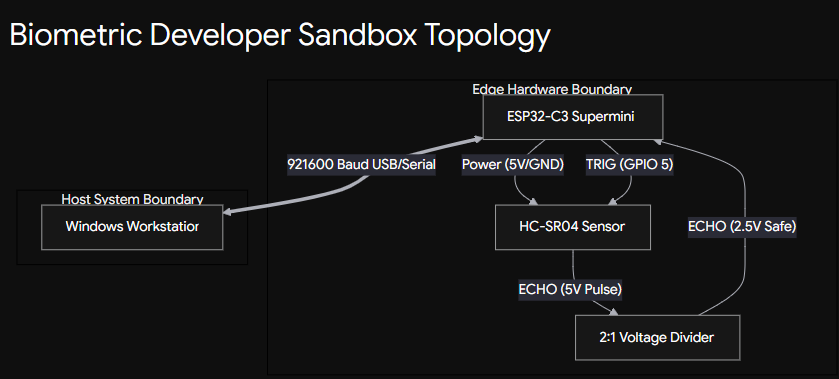

# BDSC: Zero-Trust Physical Security System for Hybrid Workers

  

## 🎥 Watch the Demo (Click the Image)
[](https://www.linkedin.com/posts/krishna-singh-a81982272_quackathon2026-softwareengineering-edgecomputing-ugcPost-7474889442202140673--3pF/?utm_source=share&utm_medium=member_desktop&rcm=ACoAAEK1J4EBqU4rSu0Ihzpa8UyMasYUpbe0IAYhttps://www.linkedin.com/posts/krishna-singh-a81982272_quackathon2026-softwareengineering-edgecomputing-ugcPost-7474889442202140673--3pF/?utm_source=share&utm_medium=member_desktop&rcm=ACoAAEK1J4EBqU4rSu0Ihzpa8UyMasYUpbe0IAY)

## 📌 The Problem
In the era of hybrid and remote work, digital security (VPNs, 2FA) is stronger than ever, but **physical security is fundamentally broken**. When a worker in a cafe, co-working space, or shared office looks away from their screen, they are immediately vulnerable to "shoulder surfing" or hardware theft. 

## 🚀 The Solution: Biometric Developer Sandbox (BDSC)
BDSC is an **Edge-to-Cloud Distributed Security System** that creates a zero-trust physical perimeter around a workstation. It uses a highly decoupled micro-architecture spanning embedded C++, Python IPC, Cloud Vision APIs, and native OS actuation.

Unlike naive continuous-streaming webcams that waste massive amounts of power, bandwidth, and cloud API credits, BDSC uses **Lazy AI Evaluation**. A low-power hardware edge sensor acts as the trigger, waking up the Cloud AI *only* when a physical anomaly occurs.

---

## 🧠 System Architecture & Innovation

### 1. Edge Sensor Fusion (Embedded C++)
The system runs on an **ESP32-C3 RISC-V microcontroller**. Rather than polling a sensor in a blocking `while(true)` loop, the firmware utilizes highly optimized, non-blocking asynchronous timing. It establishes a 1.0-meter spatial envelope around the user. When breached, it transmits a localized hardware interrupt to the host PC.

### 2. Cross-Domain IPC (Python Gateway)
A dedicated Python Gateway daemon maintains a high-speed (`921600 baud`) Inter-Process Communication (IPC) bridge with the edge hardware. It runs a multi-threaded architecture to ensure serial monitoring never blocks the main cognitive loop.

### 3. Multi-Modal Cloud Perception (Afferens AI API)
When the IPC gateway receives a `<TRG:1>` packet from the edge, it performs a **lazy evaluation** query to the Afferens Cloud Vision API. The optical sensor is actually decoupled from the host—it uses a live phone camera stream as the remote perception node.

### 4. Context-Aware Threat Cognition
The system isn't just a dumb alarm; it implements an **Operator Filter** via JSON cognitive parsing:
*   `0 Humans Detected` = Environmental anomaly (e.g., a chair moved). Ignored.
*   `1 Human Detected` = Authorized Operator. System maintains standby.
*   `2+ Humans Detected` = Intruder detected behind the Operator! Initiates Lockdown.

### 5. Native OS Actuation & Digital Siren
Upon threat verification, the system executes a dual-layer defensive response:
1.  **AI Digital Siren:** Bypassing low-voltage hardware buzzer constraints, the gateway synthesizes an escalating multi-frequency siren directly through the host PC's audio drivers (`winsound.Beep`) running in a daemon thread.
2.  **OS-Level Lockdown:** The Python daemon drops down to native Windows APIs (`ctypes.windll.user32.LockWorkStation()`) to instantly and physically lock the machine, securing all on-screen data before the intruder can view it.

---

## 🛠️ Hardware Schematics (Wiring)



*(Note: The HC-SR04 outputs a 5V signal on the ECHO pin. A simple 2:1 resistor voltage divider is used to drop this to 3.3V to protect the ESP32-C3's GPIO 6 pin).*

---

## 🛠️ How to Run

1. **Edge Hardware:** Flash `firmware_esp32c3.cpp` to an ESP32-C3 Supermini.
2. **Environment:** Copy `gateway/.env.example` to `gateway/.env` and insert your Afferens API key.
3. **Gateway Setup:** 
   ```bash
   cd gateway
   pip install -r requirements.txt # (Ensure python-dotenv and pyserial are installed)
   python gateway.py --port COM5
   ```
4. **Live Perception:** Open `afferens.com/node` on a smartphone to stream live optical data to the cloud.

## 🔌 Sponsor Tool Integration: Afferens API
*(Fulfills the Quackathon "Tool Integration" submission requirement)*

This project heavily utilizes the **Afferens Cloud API** as its core cognitive engine. Instead of running slow, localized computer vision, we offload perception to the Afferens platform:
1. **Perception Node:** We use the Afferens mobile node (`afferens.com/node`) to turn any smartphone into a remote optical sensor.
2. **Cognitive Logic:** The gateway queries the Afferens `/api/perception` endpoint using the `VISION` modality. It parses the JSON response to extract `objects`, `labels`, and `confidence` scores.
3. **Integration Code:** All Afferens integration logic is clearly documented and executed in the main `gateway.py` loop.

---

## 🦆 Built for the Quackathon
BDSC demonstrates true full-stack engineering: hardware interrupts, high-speed serial IPC, multi-threading, RESTful Cloud AI integration, and native OS process execution. 